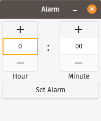

# Simple Alarm

A simple alarm application written in Python with a GUI using GTK+ 3. For some reason an application like this doesn't seem to have been created yet (besides KAlarm, which is relatively complicated if you want to just set a simple alarm), so I decided to create it myself.

## Dependencies
- Python 3
- GTK+ 3.0 or higher
- gobject-introspection
- playsound

## Running
To run the application, simply download/clone the repository, and execute `python3 start.py`. Assuming the required dependencies are installed, the application should start.

### Sidenote: Running on Windows
I haven't really designed this application with Windows in mind, as there are much more capable applications available on that platform, however in theory it should work. However, to start the application in Windows, you will need to follow the instructions provided at [Getting Started -- PyGObject](https://pygobject.readthedocs.io/en/latest/getting_started.html#windows-getting-started)
